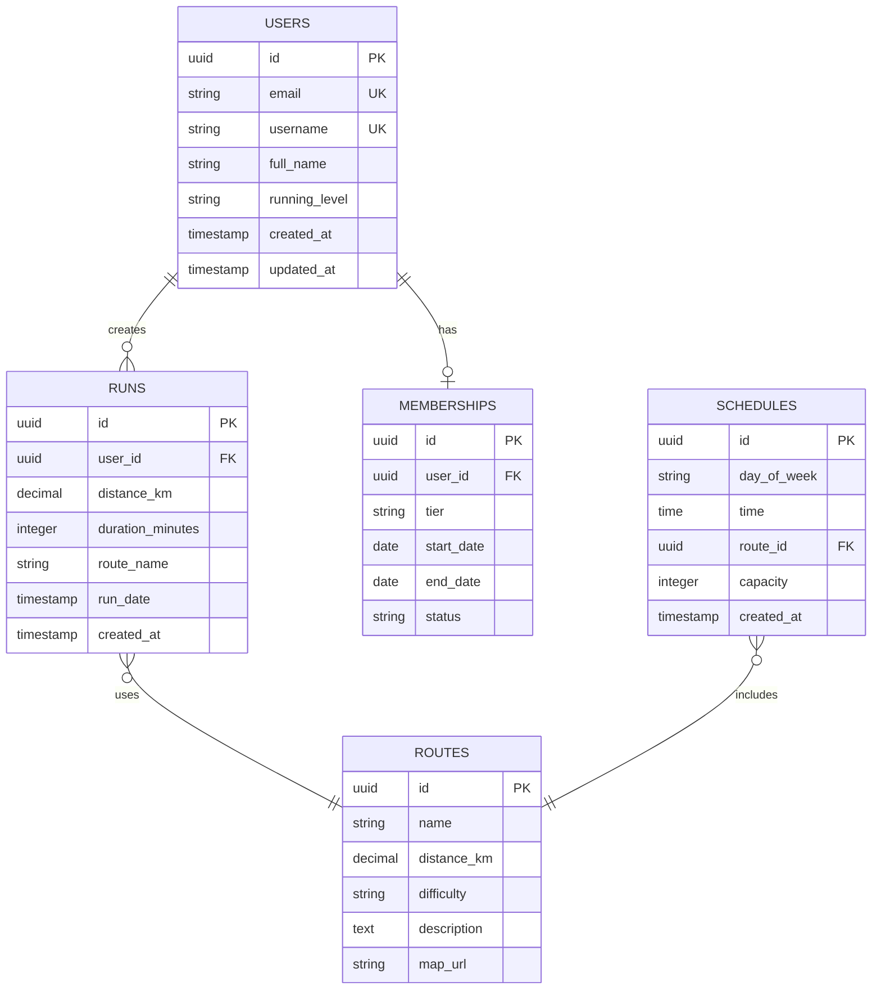

# Urban Runners 러닝 크루 홈페이지 TRD

## 🛠️ 기술 스택

```yaml
Frontend:
  Framework: Next.js 14+ (App Router)
  Language: TypeScript 5.0+
  UI Library: shadcn/ui
  Styling: Tailwind CSS 3.4+
  
Backend:
  Database: Supabase (PostgreSQL)
  Auth: Supabase Auth
  Storage: Supabase Storage
  
Deployment:
  Platform: Vercel
  CI/CD: GitHub Actions
  Domain: TBD
  
Development:
  Package Manager: npm
  Version Control: Git/GitHub
  Code Formatter: Prettier
  Linter: ESLint
```

---

## 📁 프로젝트 구조

```
urban-runners/
├── 📂 app/
│   ├── 📄 layout.tsx              # 루트 레이아웃
│   ├── 📄 page.tsx                # HOME 페이지
│   ├── 📄 globals.css             # 전역 스타일
│   ├── 📂 about/
│   │   └── 📄 page.tsx
│   ├── 📂 schedule/
│   │   └── 📄 page.tsx
│   ├── 📂 membership/
│   │   └── 📄 page.tsx
│   ├── 📂 routes/
│   │   └── 📄 page.tsx
│   ├── 📂 join/
│   │   └── 📄 page.tsx
│   ├── 📂 login/
│   │   └── 📄 page.tsx
│   ├── 📂 dashboard/
│   │   └── 📄 page.tsx
│   ├── 📂 gallery/
│   │   └── 📄 page.tsx
│   └── 📂 api/
│       ├── 📂 auth/
│       ├── 📂 runs/
│       └── 📂 users/
├── 📂 components/
│   ├── 📂 ui/                     # shadcn components
│   │   ├── 📄 button.tsx
│   │   ├── 📄 input.tsx
│   │   ├── 📄 card.tsx
│   │   └── 📄 ...
│   ├── 📄 Navigation.tsx          # 전역 네비게이션
│   ├── 📄 HeroSection.tsx         # 히어로 섹션
│   ├── 📄 StatCard.tsx            # 통계 카드
│   ├── 📄 RunnerSilhouette.tsx    # 러너 애니메이션
│   ├── 📄 LoadingBar.tsx          # 로딩 바
│   ├── 📄 BrutalButton.tsx        # 브루탈 버튼
│   └── 📄 ConcreteTexture.tsx     # 콘크리트 배경
├── 📂 lib/
│   ├── 📄 supabase.ts             # Supabase 클라이언트
│   ├── 📄 utils.ts                # 유틸리티 함수
│   └── 📄 constants.ts            # 상수 정의
├── 📂 types/
│   └── 📄 index.ts                # TypeScript 타입
├── 📂 hooks/
│   ├── 📄 useAuth.ts
│   ├── 📄 useRuns.ts
│   └── 📄 useStats.ts
├── 📂 public/
│   ├── 📂 screens/                # 참조용 이미지
│   ├── 📂 icons/
│   └── 📂 fonts/
├── 📂 supabase/
│   └── 📂 migrations/
│       ├── 📄 001_create_users.sql
│       ├── 📄 002_create_runs.sql
│       └── 📄 ...
├── 📄 .env.local                  # 환경 변수
├── 📄 .eslintrc.json
├── 📄 .prettierrc
├── 📄 next.config.js
├── 📄 tailwind.config.ts
├── 📄 tsconfig.json
└── 📄 package.json
```

---

## 💾 데이터베이스 스키마

### ERD



### Table Definitions

#### 1️⃣ Users Table

```sql
CREATE TABLE users (
  id UUID PRIMARY KEY DEFAULT uuid_generate_v4(),
  email VARCHAR(255) UNIQUE NOT NULL,
  username VARCHAR(100) UNIQUE NOT NULL,
  full_name VARCHAR(255),
  running_level VARCHAR(50) CHECK (running_level IN ('beginner', 'intermediate', 'advanced')),
  avatar_url TEXT,
  created_at TIMESTAMP WITH TIME ZONE DEFAULT NOW(),
  updated_at TIMESTAMP WITH TIME ZONE DEFAULT NOW()
);

-- Indexes
CREATE INDEX idx_users_email ON users(email);
CREATE INDEX idx_users_username ON users(username);

-- RLS Policies
ALTER TABLE users ENABLE ROW LEVEL SECURITY;

CREATE POLICY "Users can view their own data"
  ON users FOR SELECT
  USING (auth.uid() = id);

CREATE POLICY "Users can update their own data"
  ON users FOR UPDATE
  USING (auth.uid() = id);
```

#### 2️⃣ Runs Table

```sql
CREATE TABLE runs (
  id UUID PRIMARY KEY DEFAULT uuid_generate_v4(),
  user_id UUID NOT NULL REFERENCES users(id) ON DELETE CASCADE,
  distance_km DECIMAL(5,2) NOT NULL CHECK (distance_km > 0),
  duration_minutes INTEGER NOT NULL CHECK (duration_minutes > 0),
  route_name VARCHAR(255),
  pace_per_km DECIMAL(4,2), -- Calculated field
  run_date TIMESTAMP WITH TIME ZONE NOT NULL,
  notes TEXT,
  created_at TIMESTAMP WITH TIME ZONE DEFAULT NOW()
);

-- Indexes
CREATE INDEX idx_runs_user_id ON runs(user_id);
CREATE INDEX idx_runs_run_date ON runs(run_date DESC);

-- RLS Policies
ALTER TABLE runs ENABLE ROW LEVEL SECURITY;

CREATE POLICY "Users can view their own runs"
  ON runs FOR SELECT
  USING (auth.uid() = user_id);

CREATE POLICY "Users can insert their own runs"
  ON runs FOR INSERT
  WITH CHECK (auth.uid() = user_id);

CREATE POLICY "Users can update their own runs"
  ON runs FOR UPDATE
  USING (auth.uid() = user_id);

CREATE POLICY "Users can delete their own runs"
  ON runs FOR DELETE
  USING (auth.uid() = user_id);
```

#### 3️⃣ Memberships Table

```sql
CREATE TABLE memberships (
  id UUID PRIMARY KEY DEFAULT uuid_generate_v4(),
  user_id UUID NOT NULL REFERENCES users(id) ON DELETE CASCADE,
  tier VARCHAR(50) NOT NULL CHECK (tier IN ('basic', 'elite')),
  start_date DATE NOT NULL,
  end_date DATE,
  status VARCHAR(50) DEFAULT 'active' CHECK (status IN ('active', 'inactive', 'expired')),
  created_at TIMESTAMP WITH TIME ZONE DEFAULT NOW(),
  updated_at TIMESTAMP WITH TIME ZONE DEFAULT NOW(),
  CONSTRAINT unique_active_membership UNIQUE (user_id, status)
);

-- Indexes
CREATE INDEX idx_memberships_user_id ON memberships(user_id);
CREATE INDEX idx_memberships_status ON memberships(status);

-- RLS Policies
ALTER TABLE memberships ENABLE ROW LEVEL SECURITY;

CREATE POLICY "Users can view their own membership"
  ON memberships FOR SELECT
  USING (auth.uid() = user_id);
```

#### 4️⃣ Routes Table

```sql
CREATE TABLE routes (
  id UUID PRIMARY KEY DEFAULT uuid_generate_v4(),
  name VARCHAR(255) NOT NULL,
  distance_km DECIMAL(5,2) NOT NULL CHECK (distance_km > 0),
  difficulty VARCHAR(50) CHECK (difficulty IN ('easy', 'medium', 'hard')),
  description TEXT,
  map_url VARCHAR(500),
  elevation_gain INTEGER, -- meters
  created_at TIMESTAMP WITH TIME ZONE DEFAULT NOW(),
  updated_at TIMESTAMP WITH TIME ZONE DEFAULT NOW()
);

-- Indexes
CREATE INDEX idx_routes_difficulty ON routes(difficulty);
CREATE INDEX idx_routes_distance ON routes(distance_km);

-- RLS Policies
ALTER TABLE routes ENABLE ROW LEVEL SECURITY;

CREATE POLICY "Routes are viewable by everyone"
  ON routes FOR SELECT
  TO authenticated
  USING (true);
```

#### 5️⃣ Schedules Table

```sql
CREATE TABLE schedules (
  id UUID PRIMARY KEY DEFAULT uuid_generate_v4(),
  day_of_week VARCHAR(20) NOT NULL CHECK (day_of_week IN ('MON-WED', 'THU-SAT')),
  time TIME NOT NULL,
  route_id UUID REFERENCES routes(id) ON DELETE SET NULL,
  capacity INTEGER DEFAULT 30 CHECK (capacity > 0),
  is_active BOOLEAN DEFAULT true,
  created_at TIMESTAMP WITH TIME ZONE DEFAULT NOW(),
  updated_at TIMESTAMP WITH TIME ZONE DEFAULT NOW()
);

-- Indexes
CREATE INDEX idx_schedules_day ON schedules(day_of_week);
CREATE INDEX idx_schedules_is_active ON schedules(is_active);

-- RLS Policies
ALTER TABLE schedules ENABLE ROW LEVEL SECURITY;

CREATE POLICY "Schedules are viewable by everyone"
  ON schedules FOR SELECT
  TO authenticated
  USING (true);
```

---

## 🎨 컴포넌트 아키텍처

### 1. BrutalButton Component

```typescript
// components/BrutalButton.tsx
import { cn } from '@/lib/utils';
import Link from 'next/link';

interface BrutalButtonProps {
  children: React.ReactNode;
  variant?: 'primary' | 'secondary' | 'accent-green' | 'accent-blue';
  size?: 'sm' | 'md' | 'lg';
  onClick?: () => void;
  href?: string;
  className?: string;
  disabled?: boolean;
}

const variants = {
  primary: 'bg-brutal-orange text-white hover:bg-white hover:text-black',
  secondary: 'bg-black text-white hover:bg-brutal-orange hover:text-white',
  'accent-green': 'bg-green-500 text-black hover:bg-black hover:text-green-500',
  'accent-blue': 'bg-blue-500 text-white hover:bg-white hover:text-blue-500',
};

const sizes = {
  sm: 'px-4 py-2 text-sm border-3',
  md: 'px-6 py-3 text-base border-4',
  lg: 'px-8 py-4 text-lg border-5',
};

export function BrutalButton({
  children,
  variant = 'primary',
  size = 'md',
  onClick,
  href,
  className,
  disabled = false,
}: BrutalButtonProps) {
  const baseClasses = cn(
    'font-brutal font-black uppercase border-black',
    'transition-all duration-300 ease-out',
    'hover:scale-105 active:scale-95',
    'shadow-brutal hover:shadow-brutal-sm',
    'disabled:opacity-50 disabled:cursor-not-allowed disabled:hover:scale-100',
    variants[variant],
    sizes[size],
    className
  );

  if (href && !disabled) {
    return (
      <Link href={href} className={baseClasses}>
        {children}
      </Link>
    );
  }

  return (
    <button onClick={onClick} disabled={disabled} className={baseClasses}>
      {children}
    </button>
  );
}
```

### 2. ConcreteTexture Component

```typescript
// components/ConcreteTexture.tsx
export function ConcreteTexture() {
  return (
    <div className="absolute inset-0 w-full h-full pointer-events-none overflow-hidden">
      <svg className="w-full h-full opacity-10" xmlns="http://www.w3.org/2000/svg">
        <defs>
          <pattern id="concrete-pattern" x="0" y="0" width="200" height="200" patternUnits="userSpaceOnUse">
            {/* 콘크리트 균열 효과 */}
            <path
              d="M10,50 Q30,40 50,50 T90,50"
              stroke="#000"
              fill="none"
              strokeWidth="1"
              opacity="0.3"
            />
            <path
              d="M150,80 L120,100 L140,120"
              stroke="#000"
              fill="none"
              strokeWidth="1"
              opacity="0.2"
            />
            
            {/* 노이즈 점들 */}
            {Array.from({ length: 20 }).map((_, i) => (
              <circle
                key={i}
                cx={Math.random() * 200}
                cy={Math.random() * 200}
                r={Math.random() * 2}
                fill="#666"
                opacity={Math.random() * 0.5}
              />
            ))}
          </pattern>
        </defs>
        <rect width="100%" height="100%" fill="url(#concrete-pattern)" />
      </svg>
    </div>
  );
}
```

### 3. RunnerSilhouette Component

```typescript
// components/RunnerSilhouette.tsx
'use client';

import { motion } from 'framer-motion';

export function RunnerSilhouette() {
  return (
    <motion.div
      className="absolute bottom-10 w-20 h-20"
      animate={{
        x: ['0vw', '90vw', '0vw'],
      }}
      transition={{
        duration: 6,
        repeat: Infinity,
        ease: 'linear',
      }}
    >
      <svg
        viewBox="0 0 64 64"
        fill="currentColor"
        className="w-full h-full text-black"
      >
        {/* 러너 실루엣 SVG Path */}
        <path d="M32 8c-2.2 0-4 1.8-4 4s1.8 4 4 4 4-1.8 4-4-1.8-4-4-4zm-8 16c-1.1 0-2 .9-2 2v12l-6 18h4l5-15v15h4V42l5 14h4l-6-18V26c0-1.1-.9-2-2-2h-6z" />
      </svg>
    </motion.div>
  );
}
```

### 4. LoadingBar Component

```typescript
// components/LoadingBar.tsx
'use client';

import { useEffect, useState } from 'react';

interface LoadingBarProps {
  onComplete?: () => void;
}

export function LoadingBar({ onComplete }: LoadingBarProps) {
  const [progress, setProgress] = useState(0);
  const [message, setMessage] = useState('CONNECTING...');

  useEffect(() => {
    const interval = setInterval(() => {
      setProgress((prev) => {
        if (prev >= 100) {
          clearInterval(interval);
          onComplete?.();
          return 100;
        }
        
        // 메시지 업데이트
        if (prev > 30 && prev < 70) {
          setMessage('SYNCING DATA');
        } else if (prev >= 70) {
          setMessage('READY TO RUN');
        }
        
        return prev + 2;
      });
    }, 50);

    return () => clearInterval(interval);
  }, [onComplete]);

  return (
    <div className="fixed inset-0 flex items-center justify-center bg-concrete-200">
      <div className="w-full max-w-2xl px-8">
        <h2 className="font-brutal text-4xl mb-8 text-center">{message}</h2>
        
        <div className="relative h-16 border-4 border-black bg-white overflow-hidden">
          <div
            className="absolute inset-0 bg-brutal-orange transition-all duration-100"
            style={{ width: `${progress}%` }}
          >
            <div className="absolute inset-0 bg-gradient-to-r from-orange-400 to-orange-600 animate-pulse" />
          </div>
        </div>
        
        <p className="text-right mt-4 font-brutal text-2xl">{progress}%</p>
        
        <div className="mt-8 text-center">
          <span className="font-brutal text-brutal-orange text-xl">NO LIMIT</span>
        </div>
      </div>
    </div>
  );
}
```

### 5. StatCard Component

```typescript
// components/StatCard.tsx
interface StatCardProps {
  label: string;
  value: string | number;
  color?: 'orange' | 'green' | 'blue' | 'red';
}

const colorClasses = {
  orange: 'bg-brutal-orange',
  green: 'bg-green-500',
  blue: 'bg-blue-500',
  red: 'bg-red-500',
};

export function StatCard({ label, value, color = 'orange' }: StatCardProps) {
  return (
    <div className={`border-4 border-black p-6 ${colorClasses[color]} shadow-brutal`}>
      <div className="text-sm font-brutal text-black mb-2">{label}</div>
      <div className="text-4xl font-brutal text-black">{value}</div>
    </div>
  );
}
```

---

## 🎨 Tailwind Configuration

```typescript
// tailwind.config.ts
import type { Config } from 'tailwindcss';

const config: Config = {
  darkMode: ['class'],
  content: [
    './pages/**/*.{ts,tsx}',
    './components/**/*.{ts,tsx}',
    './app/**/*.{ts,tsx}',
  ],
  theme: {
    extend: {
      colors: {
        'brutal-orange': '#FF6B00',
        'brutal-gray': '#CCCCCC',
        concrete: {
          100: '#F5F5F5',
          200: '#E5E5E5',
          300: '#D4D4D4',
          400: '#A3A3A3',
          500: '#737373',
        },
      },
      fontFamily: {
        brutal: ['Impact', 'Arial Black', 'sans-serif'],
      },
      boxShadow: {
        brutal: '8px 8px 0px 0px rgba(0,0,0,1)',
        'brutal-sm': '4px 4px 0px 0px rgba(0,0,0,1)',
        'brutal-lg': '12px 12px 0px 0px rgba(0,0,0,1)',
      },
      borderWidth: {
        '3': '3px',
        '5': '5px',
        '6': '6px',
      },
      animation: {
        'slide-right': 'slideRight 6s linear infinite',
      },
      keyframes: {
        slideRight: {
          '0%, 100%': { transform: 'translateX(0)' },
          '50%': { transform: 'translateX(calc(100vw - 5rem))' },
        },
      },
    },
  },
  plugins: [require('tailwindcss-animate')],
};

export default config;
```

---

## 🔌 API 설계

### Authentication

```typescript
// POST /api/auth/signup
interface SignupRequest {
  email: string;
  password: string;
  username: string;
  fullName: string;
  runningLevel: 'beginner' | 'intermediate' | 'advanced';
}

interface SignupResponse {
  user: User;
  session: Session;
}

// POST /api/auth/login
interface LoginRequest {
  email: string;
  password: string;
}

interface LoginResponse {
  user: User;
  session: Session;
}

// POST /api/auth/logout
interface LogoutResponse {
  success: boolean;
}

// GET /api/auth/me
interface MeResponse {
  user: User | null;
}
```

### Users

```typescript
// GET /api/users/:id
interface GetUserResponse {
  user: User;
}

// PATCH /api/users/:id
interface UpdateUserRequest {
  fullName?: string;
  runningLevel?: 'beginner' | 'intermediate' | 'advanced';
  avatarUrl?: string;
}

interface UpdateUserResponse {
  user: User;
}

// GET /api/users/:id/stats
interface GetUserStatsResponse {
  totalRuns: number;
  totalDistance: number;
  thisWeekDistance: number;
  bestTime: string;
  rank: number;
}
```

### Runs

```typescript
// GET /api/runs
interface GetRunsRequest {
  userId?: string;
  startDate?: string;
  endDate?: string;
  limit?: number;
  offset?: number;
}

interface GetRunsResponse {
  runs: Run[];
  total: number;
}

// POST /api/runs
interface CreateRunRequest {
  distanceKm: number;
  durationMinutes: number;
  routeName?: string;
  runDate: string;
  notes?: string;
}

interface CreateRunResponse {
  run: Run;
}

// DELETE /api/runs/:id
interface DeleteRunResponse {
  success: boolean;
}
```

### Schedules

```typescript
// GET /api/schedules
interface GetSchedulesResponse {
  schedules: Schedule[];
}

// GET /api/schedules/week
interface GetWeekScheduleResponse {
  monWed: Schedule[];
  thuSat: Schedule[];
}
```

---

## 🔒 Supabase Setup

### 1. Supabase Client

```typescript
// lib/supabase.ts
import { createClient } from '@supabase/supabase-js';

const supabaseUrl = process.env.NEXT_PUBLIC_SUPABASE_URL!;
const supabaseAnonKey = process.env.NEXT_PUBLIC_SUPABASE_ANON_KEY!;

export const supabase = createClient(supabaseUrl, supabaseAnonKey);

// Type-safe client
import { Database } from '@/types/supabase';

export const supabaseTyped = createClient<Database>(
  supabaseUrl,
  supabaseAnonKey
);
```

### 2. Auth Hooks

```typescript
// hooks/useAuth.ts
'use client';

import { useEffect, useState } from 'react';
import { supabase } from '@/lib/supabase';
import { User } from '@supabase/supabase-js';

export function useAuth() {
  const [user, setUser] = useState<User | null>(null);
  const [loading, setLoading] = useState(true);

  useEffect(() => {
    // Get initial session
    supabase.auth.getSession().then(({ data: { session } }) => {
      setUser(session?.user ?? null);
      setLoading(false);
    });

    // Listen for auth changes
    const {
      data: { subscription },
    } = supabase.auth.onAuthStateChange((_event, session) => {
      setUser(session?.user ?? null);
    });

    return () => subscription.unsubscribe();
  }, []);

  const signUp = async (email: string, password: string, metadata: any) => {
    const { data, error } = await supabase.auth.signUp({
      email,
      password,
      options: {
        data: metadata,
      },
    });
    return { data, error };
  };

  const signIn = async (email: string, password: string) => {
    const { data, error } = await supabase.auth.signInWithPassword({
      email,
      password,
    });
    return { data, error };
  };

  const signOut = async () => {
    const { error } = await supabase.auth.signOut();
    return { error };
  };

  return {
    user,
    loading,
    signUp,
    signIn,
    signOut,
  };
}
```

---

## 🚀 배포 설정

### Vercel Configuration

```json
// vercel.json
{
  "buildCommand": "npm run build",
  "devCommand": "npm run dev",
  "installCommand": "npm install",
  "framework": "nextjs",
  "regions": ["icn1"],
  "env": {
    "NEXT_PUBLIC_SUPABASE_URL": "@supabase-url",
    "NEXT_PUBLIC_SUPABASE_ANON_KEY": "@supabase-anon-key"
  }
}
```

### GitHub Actions

```yaml
# .github/workflows/deploy.yml
name: Deploy to Vercel

on:
  push:
    branches:
      - main
  pull_request:
    branches:
      - main

jobs:
  deploy:
    runs-on: ubuntu-latest
    
    steps:
      - name: Checkout code
        uses: actions/checkout@v3
      
      - name: Setup Node.js
        uses: actions/setup-node@v3
        with:
          node-version: '18'
          cache: 'npm'
      
      - name: Install dependencies
        run: npm ci
      
      - name: Run linter
        run: npm run lint
      
      - name: Run type check
        run: npm run type-check
      
      - name: Build project
        run: npm run build
        env:
          NEXT_PUBLIC_SUPABASE_URL: ${{ secrets.NEXT_PUBLIC_SUPABASE_URL }}
          NEXT_PUBLIC_SUPABASE_ANON_KEY: ${{ secrets.NEXT_PUBLIC_SUPABASE_ANON_KEY }}
      
      - name: Deploy to Vercel
        uses: amondnet/vercel-action@v25
        with:
          vercel-token: ${{ secrets.VERCEL_TOKEN }}
          vercel-org-id: ${{ secrets.ORG_ID }}
          vercel-project-id: ${{ secrets.PROJECT_ID }}
          vercel-args: '--prod'
```

---

## 📦 Environment Variables

```bash
# .env.local
# Supabase
NEXT_PUBLIC_SUPABASE_URL=https://your-project.supabase.co
NEXT_PUBLIC_SUPABASE_ANON_KEY=your-anon-key
SUPABASE_SERVICE_ROLE_KEY=your-service-role-key

# App
NEXT_PUBLIC_APP_URL=http://localhost:3000
NODE_ENV=development

# Optional
NEXT_PUBLIC_GOOGLE_MAPS_API_KEY=your-api-key
```

---

## 🧪 테스팅 전략

### Unit Tests

```typescript
// __tests__/components/BrutalButton.test.tsx
import { render, screen } from '@testing-library/react';
import { BrutalButton } from '@/components/BrutalButton';

describe('BrutalButton', () => {
  it('renders correctly', () => {
    render(<BrutalButton>Click Me</BrutalButton>);
    expect(screen.getByText('Click Me')).toBeInTheDocument();
  });

  it('applies correct variant classes', () => {
    render(<BrutalButton variant="secondary">Button</BrutalButton>);
    const button = screen.getByText('Button');
    expect(button).toHaveClass('bg-black');
  });
});
```

### E2E Tests (Playwright)

```typescript
// e2e/auth.spec.ts
import { test, expect } from '@playwright/test';

test('user can sign up', async ({ page }) => {
  await page.goto('/join');
  
  await page.fill('input[name="email"]', 'test@example.com');
  await page.fill('input[name="password"]', 'password123');
  await page.fill('input[name="username"]', 'testuser');
  
  await page.click('button[type="submit"]');
  
  await expect(page).toHaveURL('/dashboard');
});
```

---

## 📊 MVP 개발 로드맵

### Phase 1: 정적 페이지 + 디자인 (Week 1-2)

```markdown
## Week 1
- [ ] 프로젝트 초기 설정
  - [ ] Next.js 14 프로젝트 생성
  - [ ] Tailwind CSS 설정
  - [ ] shadcn/ui 설치
  - [ ] 디자인 토큰 정의
  
- [ ] 핵심 컴포넌트 개발
  - [ ] BrutalButton
  - [ ] ConcreteTexture
  - [ ] Navigation
  - [ ] StatCard
  
- [ ] 페이지 레이아웃
  - [ ] HOME 페이지
  - [ ] ABOUT 페이지
  - [ ] SCHEDULE 페이지

## Week 2
- [ ] 나머지 페이지
  - [ ] MEMBERSHIP
  - [ ] ROUTES
  - [ ] JOIN (정적 폼)
  - [ ] LOGIN (정적 폼)
  - [ ] DASHBOARD (모킹 데이터)
  - [ ] GALLERY
  
- [ ] 인터랙션
  - [ ] 호버 효과
  - [ ] RunnerSilhouette 애니메이션
  - [ ] LoadingBar 애니메이션
  - [ ] 페이지 전환 효과
```

### Phase 2: 인증 시스템 (Week 3)

```markdown
- [ ] Supabase 설정
  - [ ] 프로젝트 생성
  - [ ] Auth 설정
  - [ ] Users 테이블 생성
  - [ ] RLS 정책 설정
  
- [ ] 인증 구현
  - [ ] useAuth 훅
  - [ ] 회원가입 폼 연동
  - [ ] 로그인 폼 연동
  - [ ] 로그아웃 기능
  - [ ] Protected Routes
  - [ ] 세션 관리
```

### Phase 3: 동적 기능 (Week 4)

```markdown
- [ ] 데이터베이스 마이그레이션
  - [ ] Runs 테이블
  - [ ] Memberships 테이블
  - [ ] Routes 테이블
  - [ ] Schedules 테이블
  
- [ ] API 구현
  - [ ] /api/users
  - [ ] /api/runs
  - [ ] /api/schedules
  
- [ ] 페이지 연동
  - [ ] DASHBOARD (실제 데이터)
  - [ ] ROUTES (DB 연동)
  - [ ] SCHEDULE (DB 연동)
```

### Phase 4: 고도화 (Week 5)

```markdown
- [ ] 추가 기능
  - [ ] GALLERY 이미지 업로드
  - [ ] FEEDBACK 시스템
  - [ ] 알림 기능
  - [ ] 프로필 수정
  
- [ ] 최적화
  - [ ] 이미지 최적화
  - [ ] 코드 스플리팅
  - [ ] SEO 최적화
  - [ ] 성능 측정 (Lighthouse)
  
- [ ] 배포
  - [ ] Vercel 연동
  - [ ] 환경변수 설정
  - [ ] 도메인 연결
  - [ ] CI/CD 파이프라인
```

---

## 📈 성능 최적화

### Image Optimization

```typescript
// next.config.js
module.exports = {
  images: {
    formats: ['image/avif', 'image/webp'],
    deviceSizes: [640, 750, 828, 1080, 1200, 1920, 2048, 3840],
    imageSizes: [16, 32, 48, 64, 96, 128, 256, 384],
  },
};
```

### Font Optimization

```typescript
// app/layout.tsx
import localFont from 'next/font/local';

const impact = localFont({
  src: '../public/fonts/impact.woff2',
  variable: '--font-brutal',
  display: 'swap',
});
```

---

## 📱 반응형 디자인 전략

```css
/* Mobile First */
.hero-title {
  @apply text-4xl;
}

/* Tablet */
@media (min-width: 768px) {
  .hero-title {
    @apply text-6xl;
  }
}

/* Desktop */
@media (min-width: 1024px) {
  .hero-title {
    @apply text-8xl;
  }
}
```

---

## 🔐 보안 체크리스트

- [ ] HTTPS 강제
- [ ] CSRF 토큰
- [ ] XSS 방어 (React 기본 제공)
- [ ] SQL Injection (Supabase RLS)
- [ ] Rate Limiting
- [ ] 환경변수 보안
- [ ] 비밀번호 해싱 (Supabase Auth)
- [ ] Content Security Policy

---

## 📎 관련 문서

- [[PRD_Urban_Runners]] - 제품 요구사항 문서
- [[Deployment_Guide]] - 배포 가이드
- [[Testing_Strategy]] - 테스팅 전략

---

## 📝 변경 이력

| 버전 | 날짜 | 변경 내용 | 작성자 |
|------|------|-----------|--------|
| 1.0 | 2024-12-14 | 초안 작성 | Team |

---

> [!tip] 개발 시작 전 체크리스트
> 1. ✅ Node.js 18+ 설치
> 2. ✅ Supabase 계정 생성
> 3. ✅ Vercel 계정 생성
> 4. ✅ GitHub 저장소 준비
> 5. ✅ 환경변수 설정
