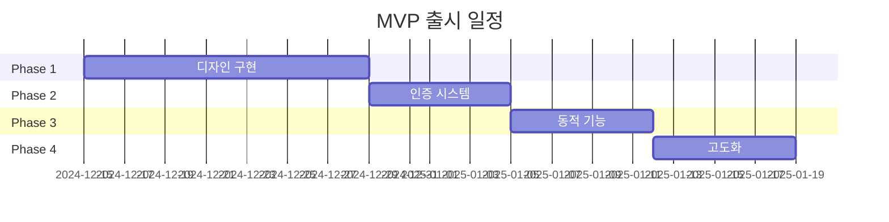

# Urban Runners 러닝 크루 홈페이지 PRD

## 📋 개요

> [!info] 제품 정보
> - **제품명**: Urban Runners 러닝 크루 홈페이지
> - **컨셉**: 네오 브루탈리즘 디자인의 도심 러닝 크루 커뮤니티 플랫폼
> - **핵심 가치**: "CONCRETE MILES, RAW SPEED" - 거친 도시 환경에서의 열정적인 러닝 문화

## 🎯 핵심 기능 요구사항

### 페이지 구성

#### 1. HOME (최우선 🔴)

```yaml
우선순위: 최우선
구성요소:
  - 메인 히어로 섹션: "URBAN RUNNERS" 타이포그래피
  - 태그라인: "NO LIMITS"
  - 서브카피: "CONCRETE MILES / RAW SPEED"
  - CTA 버튼:
      - JOIN CREW
      - ADVISORY
      - QUICK FACTS
      - STATISTICS
      - CONTACT US
  - 러너 실루엣 애니메이션
```

**핵심 기능**:
- [ ] 강렬한 첫인상을 주는 타이포그래피
- [ ] 인터랙티브한 CTA 버튼
- [ ] 러너 애니메이션 루프

---

#### 2. ABOUT (우선순위 높음 🟠)

```yaml
우선순위: 높음
데이터:
  - EST. 2020: 설립 연도
  - 248 MEMBERS: 회원 수
  - STEEL COMMITMENT: 철학
내용:
  - 크루 소개
  - 미션 & 비전
  - 핵심 가치
```

**표시 정보**:
- [ ] EST. 2020
- [ ] 248 MEMBERS
- [ ] STEEL COMMITMENT 메시지
- [ ] 러너 실루엣 그래픽

---

#### 3. SCHEDULE (우선순위 높음 🟠)

```yaml
우선순위: 높음
일정 그룹:
  - MON-WED: 주초반 그룹
  - THU-SAT: 주후반 그룹
메시지:
  - CONSISTENCY
  - WCHEDULE SCHEDULE (타이포그래피 효과)
```

**기능 요구사항**:
- [ ] 요일별 러닝 일정 표시
- [ ] 참여 가능 인원 표시
- [ ] 일정 등록 기능 (추후)

---

#### 4. MEMBERSHIP (우선순위 중간 🟡)

```yaml
우선순위: 중간
티어:
  - BASIC TIER: 기본 멤버십
  - ELITE CREW: 프리미엄 멤버십
혜택:
  - STEEL COMMITMENT
  - 전용 이벤트 참여
  - 우선 등록
```

**표시 요소**:
- [ ] 멤버십 티어 카드
- [ ] 혜택 리스트
- [ ] CONTACT 링크
- [ ] 가격 정보 (추후)

---

#### 5. ROUTES (우선순위 중간 🟡)

```yaml
우선순위: 중간
코스 종류:
  - 5KM LOOP: 초급
  - 10KM CHALLENGE: 중급
  - MARATHON PREP: 고급
정보:
  - ROUTE/DATES: 코스별 일정
```

**표시 정보**:
- [ ] 코스 난이도별 분류
- [ ] 거리 정보
- [ ] 지도 연동 (추후)

---

#### 6. JOIN CREW (우선순위 높음 🟠)

```yaml
우선순위: 높음
입력 필드:
  - NAME: 이름
  - EMAIL: 이메일
  - PASSWORD: 비밀번호
  - RUNNING LEVEL: 러닝 레벨
제출:
  - CREATE ACCOUNT: 계정 생성
```

**폼 요구사항**:
- [ ] 입력 유효성 검사
- [ ] 에러 메시지 표시
- [ ] 성공 시 리다이렉트
- [ ] 브루탈리즘 스타일 인풋

---

#### 7. LOGIN (우선순위 높음 🟠)

```yaml
우선순위: 높음
입력 필드:
  - USERNAME: 사용자명
  - PASSWORD: 비밀번호
제출:
  - ENTER SYSTEM: 시스템 진입
링크:
  - FORGOT: 비밀번호 찾기
  - ACCESS?: 접근 권한
```

**인증 요구사항**:
- [ ] Supabase Auth 연동
- [ ] 세션 관리
- [ ] 비밀번호 찾기 기능
- [ ] 자동 로그인 옵션

---

#### 8. DASHBOARD (우선순위 중간 🟡)

```yaml
우선순위: 중간
통계 정보:
  - TOTAL RUNS: 24
  - THIS WEEK: 5KM
  - BEST TIME: 22:15
  - RANK: #12
액션:
  - NEXT RUN: 다음 러닝 예약
```

**대시보드 기능**:
- [ ] 개인 러닝 통계
- [ ] 주간 활동 요약
- [ ] 랭킹 시스템
- [ ] 다음 러닝 등록

---

#### 9. GALLERY (우선순위 낮음 🟢)

```yaml
우선순위: 낮음
섹션:
  - RECENT RUNS: 최근 러닝 (4개)
  - ACHIEVEMENTS: 업적 (4개)
  - EVENT PHOTOS: 이벤트 (4개)
액션:
  - VIEW ALL: 전체 보기
```

**갤러리 요구사항**:
- [ ] 이미지 그리드 레이아웃
- [ ] 카테고리별 필터링
- [ ] 모달 뷰어
- [ ] 업로드 기능 (회원 전용)

---

#### 10. FEEDBACK (우선순위 낮음 🟢)

```yaml
우선순위: 낮음
시스템:
  - MICRO FEEDBACK
  - SUCCESS: 성공 상태
  - SYSTEM RESPONSE: 시스템 응답
  - PROCESS: 진행 상황
  - NOTIFICATION: 알림
```

**피드백 기능**:
- [ ] 실시간 상태 표시
- [ ] 프로그레스 바
- [ ] 성공/실패 메시지
- [ ] 토스트 알림

---

#### 11. LOADING (우선순위 중간 🟡)

```yaml
우선순위: 중간
상태 메시지:
  - CONNECTING...: 연결 중
  - SYNCING DATA: 데이터 동기화
  - READY TO RUN: 준비 완료
태그라인:
  - NO LIMIT
애니메이션:
  - 프로그레스 바
  - 오렌지 글로우 효과
```

**로딩 요구사항**:
- [ ] 부드러운 애니메이션
- [ ] 단계별 메시지
- [ ] 스켈레톤 UI (선택)

---

## 🎨 디자인 시스템

### 컬러 팔레트

| 용도 | 컬러 | Hex Code | 사용처 |
|------|------|----------|--------|
| Primary | 오렌지 | `#FF6B00` | CTA, 액센트 |
| Secondary | 블랙 | `#000000` | 텍스트, 테두리 |
| Background | 콘크리트 그레이 | `#CCCCCC` | 배경 |
| Accent Green | 그린 | `#00FF00` | 성공 상태 |
| Accent Blue | 블루 | `#00BFFF` | 정보 |
| Accent Red | 레드 | `#FF0000` | 경고 |

### 타이포그래피

```css
font-family: Impact, 'Arial Black', sans-serif
font-weight: 900 (Black)
text-transform: uppercase
letter-spacing: -0.02em
```

**사이즈 스케일**:
- H1: 96px / 6rem
- H2: 64px / 4rem
- H3: 48px / 3rem
- Body: 16px / 1rem
- Small: 14px / 0.875rem

### 디자인 원칙

> [!abstract] 네오 브루탈리즘 특징
> 1. **굵은 테두리**: 모든 요소에 4-6px 검은 테두리
> 2. **날카로운 모서리**: border-radius: 0 (예외: 일부 버튼)
> 3. **강한 그림자**: box-shadow: 8px 8px 0 0 black
> 4. **대담한 컬러**: 고채도 색상 대비
> 5. **콘크리트 텍스처**: 거친 배경, 균열 효과

### 레이아웃 패턴

```
┌─────────────────────────────────┐
│  Navigation (Fixed Top)         │
├─────────────────────────────────┤
│                                 │
│  Hero Section (Full Viewport)   │
│                                 │
├─────────────────────────────────┤
│  Content Blocks                 │
│  (계단식 레이아웃)               │
├─────────────────────────────────┤
│  Footer                         │
└─────────────────────────────────┘
```

---

## 🎬 인터랙션 요구사항

### 버튼 호버 효과

```css
/* Default State */
background: #FF6B00;
color: white;
border: 4px solid black;

/* Hover State */
background: white;
color: black;
border: 4px solid black;
transform: scale(1.05);
transition: all 0.3s ease;
```

### 애니메이션

| 요소 | 애니메이션 | 지속시간 | 반복 |
|------|------------|----------|------|
| 러너 실루엣 | 좌→우 이동 | 3s | 무한 |
| 로딩 바 | 0→100% | 2s | 1회 |
| 페이지 전환 | 페이드 | 0.5s | 1회 |
| CTA 버튼 | Scale up | 0.3s | 호버 시 |

### 인터랙티브 요소

- [ ] 네비게이션 메뉴 호버
- [ ] 버튼 클릭 피드백
- [ ] 폼 입력 포커스 효과
- [ ] 이미지 호버 확대
- [ ] 스크롤 애니메이션 (선택)

---

## ⚙️ 기술적 제약사항

### 성능 지표

> [!success] 목표 성능
> - First Contentful Paint: < 1.5s
> - Time to Interactive: < 3.5s
> - Lighthouse Score: 90+

### 최적화 요구사항

- [ ] 이미지: WebP 포맷 우선
- [ ] 코드 스플리팅: 페이지별
- [ ] Lazy Loading: 이미지, 컴포넌트
- [ ] Font Optimization: FOUT 방지

### 접근성

```yaml
WCAG 2.1 AA 준수:
  - 키보드 네비게이션
  - 스크린 리더 지원
  - 색상 대비 4.5:1 이상
  - alt 텍스트 필수
```

### 브라우저 지원

- ✅ Chrome (최신 2개 버전)
- ✅ Firefox (최신 2개 버전)
- ✅ Safari (최신 2개 버전)
- ✅ Edge (최신 2개 버전)
- ✅ iOS Safari
- ✅ Chrome Mobile

---

## 📱 반응형 디자인

### 브레이크포인트

```css
mobile: 0-640px
tablet: 641-1024px
desktop: 1025px+
```

### 모바일 우선 전략

1. **네비게이션**: 햄버거 메뉴
2. **타이포그래피**: 50% 축소
3. **레이아웃**: 단일 컬럼
4. **이미지**: 압축 최적화

---

## 🔐 보안 요구사항

- [ ] HTTPS 필수
- [ ] CSRF 토큰
- [ ] XSS 방어
- [ ] SQL Injection 방어 (Supabase RLS)
- [ ] 비밀번호 해싱 (bcrypt)
- [ ] Rate Limiting

---

## 📊 성공 지표 (KPI)

### Phase 1 (MVP)
- [ ] 페이지 로딩 속도 < 2초
- [ ] 회원가입 완료율 > 60%
- [ ] 모바일 호환성 100%

### Phase 2 (성장)
- [ ] 월간 활성 사용자 100명
- [ ] 러닝 참여율 > 70%
- [ ] 재방문율 > 50%

---

## 🗓️ 출시 일정



---

## 📎 관련 문서

- [[TRD_Urban_Runners]] - 기술 요구사항 문서
- [[Design_System]] - 디자인 시스템 가이드
- [[API_Specification]] - API 명세서

---

## 📝 변경 이력

| 버전 | 날짜 | 변경 내용 | 작성자 |
|------|------|-----------|--------|
| 1.0 | 2024-12-14 | 초안 작성 | Team |

---

> [!warning] 주의사항
> - 모든 디자인은 업로드된 이미지 파일을 기준으로 합니다
> - MVP는 디자인 완성도 우선입니다
> - 인터랙티브 요소는 필수입니다
